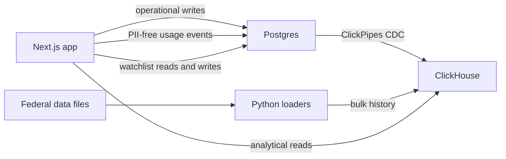

# Waterline

Waterline shows when Medicaid reimbursement does not cover what a pharmacy
paid to acquire a drug. It joins public federal pricing data at the package
level, computes gross pharmacy margin, and makes the result searchable,
watchable, and explorable over time.

The primary user is an independent pharmacist deciding whether a drug is safe
to stock. A negative margin is **underwater**; zero margin is the **waterline**.

## What it does

- Searches by brand, ingredient, or canonical NDC-11.
- Shows acquisition cost, Medicaid reimbursement, gross margin, and public
  Medicare/VA price benchmarks for each drug package.
- Ranks the worst current margins and filters brand versus generic products.
- Charts weekly NADAC acquisition cost against quarterly Medicaid
  reimbursement, including generic-entry and Medicare negotiated-price events.
- Compares Medicaid reimbursement across states.
- Writes watchlist changes to Postgres and surfaces price alerts after
  ClickPipes replicates the events into ClickHouse.
- Records PII-free signup, drug-view, and watchlist activity in Postgres and
  aggregates it live on a product-analytics page in ClickHouse.
- Replays historical NADAC changes to demonstrate the live CDC path.
- Renders an interactive, log-scale margin map with server-side ClickHouse
  binning, pan/zoom reaggregation, quarter playback, and state filtering.

## Architecture



Postgres owns operational data: users, notes, the drug dimension, watchlists,
price events, and the append-only product event log. ClickPipes replicates
`dim_drug`, `watchlist`, `price_events`, and `product_events` into
ClickHouse. The product log stores user IDs and typed actions but never emails,
note bodies, search text, IP addresses, or user agents. Immutable federal
history loads directly into ClickHouse so millions of rows do not pass through
the Postgres WAL.

New user inserts create their signup event through a Postgres trigger.
Watchlist mutations create their product event inside the same application
transaction. Drug pages emit a best-effort view event after they mount in the
browser.

The main analytical paths are:

- `margin_mv`, sorted NDC-first for drug pages and point lookups.
- `margin_map`, sorted period/state-first for interactive viewport queries.
- `margin_map_meta`, a small table of available periods, states, counts, and
  robust initial viewport bounds.
- `product_analytics.events`, a PII-free projection over the append-only
  Postgres activity log.

Every CDC-owned ClickHouse table is read through its deduplicated `*_v` view.
The application never writes directly to those replicated tables.

## Margin definition

For each state, NDC-11, year, and quarter:

```text
reimbursement per unit = total Medicaid reimbursement / units reimbursed
gross margin per unit  = reimbursement per unit - NADAC acquisition cost
```

The acquisition value is the NADAC price in effect at the quarter midpoint.
Suppressed and zero-unit Medicaid rows are excluded. The calculation is only
valid when the NADAC pricing unit agrees with the utilization basis (EA, ML,
or GM).

Medicaid amounts are pre-rebate and include the dispensing fee, so Waterline
shows gross—not net—margin. Medicare Part D, VA FSS, and Medicare maximum fair
prices are context benchmarks and are not used in the margin calculation.

## Stack

- Next.js 16, React 19, TypeScript, and Tailwind CSS
- Recharts for drug-level charts; Canvas 2D for the margin map
- Managed Postgres for operational writes
- ClickHouse Cloud for analytical history and viewport aggregation
- ClickPipes for Postgres CDC
- Python 3.11+, DuckDB, pandas, `psycopg`, and `clickhouse-connect` for loaders

## Repository layout

```text
app/                 Next.js application and API routes
clickhouse/databases/ Logical ClickHouse database DDL
clickhouse/tables/   ClickHouse fact-table DDL
clickhouse/views/    Current-row views over ClickPipes CDC tables
loaders/             Local Python ingestion, rebuild, validation, and replay tools
postgres/schema.sql  Postgres operational schema
CONTEXT.md           Canonical domain language and ownership rules
WATERLINE_BUILD_SPEC.md  Original product, architecture, and demo specification
```

Raw federal downloads live under `data/raw/` and are intentionally ignored by
Git.

## Local setup

### Prerequisites

- Node.js 20+ and pnpm
- Python 3.11+ and [uv](https://docs.astral.sh/uv/)
- A Postgres database reachable over TLS
- A ClickHouse service and, for the live path, a ClickPipe from Postgres

### Environment

Create a root `.env` for the Python loaders and an `app/.env.local` for
Next.js. Both use the same connection names:

```dotenv
PG_HOST=
PG_PORT=5432
PG_DATABASE=postgres
PG_USER=postgres
PG_PASSWORD=

CLICKHOUSE_HOST=
CLICKHOUSE_PORT=8443
CLICKHOUSE_USER=default
CLICKHOUSE_PASSWORD=
```

`PG_CA_CERT` is optional for the app when a private Postgres CA must be
provided explicitly. Never commit either environment file.

### Install and run the app

```bash
cd app
corepack enable
pnpm install
pnpm dev
```

Open <http://localhost:3000>. The main explorer is available at
<http://localhost:3000/explore>, and usage analytics at
<http://localhost:3000/analytics>.

Useful verification commands:

```bash
cd app
pnpm lint
pnpm exec tsc --noEmit
pnpm build
```

### Initialize the databases

Install the loader environment and apply the Postgres schema:

```bash
cd loaders
uv sync
uv run python apply_pg_schema.py
```

Apply the SQL files in `clickhouse/tables/` to ClickHouse. Configure the
ClickPipe to replicate `dim_drug`, `watchlist`, `price_events`, and
`product_events`. For `product_events`, use a `MergeTree` with the custom
sorting key `(event_name, event_date, ndc11, user_id, event_id)`.

After the replicated tables exist, apply these in order:

```bash
clickhousectl cloud service query --name waterline \
  --queries-file clickhouse/databases/product_analytics.sql

# cdc_current.sql contains three view statements; apply it in the SQL console
# or run each statement separately through the query endpoint.

clickhousectl cloud service query --name waterline \
  --queries-file clickhouse/views/product_analytics.sql
```

The sentinel check verifies the full Postgres-to-ClickHouse round trip:

```bash
cd loaders
uv run python roundtrip_check.py
```

### Load data

Stage the public source files under `data/raw/`, then run the loaders in this
order for the seed-data path:

```bash
cd loaders
uv run python load_dim_drug.py
uv run python select_seed.py
uv run python load_nadac.py
uv run python load_sdud.py
uv run python load_partd.py
uv run python load_fss.py
uv run python load_mfp.py
uv run python load_orange_book.py
uv run python build_margin.py
```

The historical SDUD loader can stream official yearly CSV extracts directly
from Medicaid into ClickHouse without routing gigabytes through the client:

```bash
cd loaders
uv run python load_sdud_url.py 2020 2021 2023 2026
uv run python build_margin.py
```

All NDCs must be normalized to an 11-digit, zero-padded, dash-free string.
Treat an unresolved NDC as a load failure, not as a fuzzy match.

## Live alert demo

Start the app, watch a drug, and replay recent price changes into Postgres:

```bash
cd loaders
uv run python replay.py --weeks 8 --interval 2
```

Use `--ndcs ../data/seed_ndcs.txt` to focus the replay or `--reset` to clear
existing price events before it starts. The reset deletes operational rows and
propagates through CDC, so use it deliberately.

## Public data

Waterline combines:

- CMS Medicaid NADAC acquisition-cost history
- Medicaid State Drug Utilization Data
- FDA National Drug Code Directory
- Medicare Part D spending by drug
- VA Federal Supply Schedule pharmaceutical prices
- Medicare negotiated maximum fair prices
- FDA Orange Book generic approvals

See [WATERLINE_BUILD_SPEC.md](WATERLINE_BUILD_SPEC.md) for source details,
domain caveats, and the demo narrative. See [CONTEXT.md](CONTEXT.md) for the
terminology and table-ownership rules that code changes must preserve.

## Scope

Waterline is a demo and analytical prototype, not a dispensing or claims
adjudication system. It has one seeded user and no production authentication.
Its public data cannot reveal confidential manufacturer rebates, PBM contract
terms, or a pharmacy's actual invoice price.
