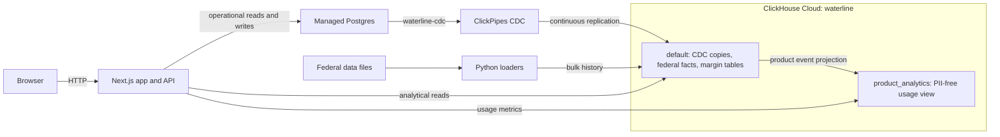

# Waterline

Waterline shows when reported pharmacy reimbursement does not cover the NADAC
acquisition-cost benchmark for a drug. It joins public federal pricing data at
the NDC-11 package level, computes a gross pre-rebate margin proxy, and makes
the result searchable, watchable, and explorable over time.

The primary user is an independent pharmacist deciding whether a drug is safe
to stock. A negative margin is **underwater**; zero margin is the **waterline**.

## What it does

- Searches by brand, ingredient, or canonical NDC-11.
- Shows NADAC acquisition cost, reported reimbursement, gross margin, and
  public Medicare/VA price benchmarks for each drug package.
- Ranks the worst current margins and filters brand versus generic products.
- Charts weekly NADAC acquisition cost against quarterly Medicaid
  reimbursement, including generic-entry and Medicare negotiated-price events.
- Compares Medicaid reimbursement across states.
- Writes watchlist changes to Postgres and surfaces price alerts after
  ClickPipes replicates the events into ClickHouse.
- Records PII-free signup, drug-view, and watchlist activity in Postgres and
  aggregates it live on a product-analytics page in ClickHouse.
- Replays historical NADAC changes to demonstrate the live CDC path.
- Renders an interactive, log-scale margin map with server-side ClickHouse
  binning, pan/zoom reaggregation, a quarter slider, and state filtering.

## Architecture



Postgres owns operational data: users, notes, the drug dimension, watchlists,
price events, and the append-only product event log. ClickPipes replicates
`dim_drug`, `watchlist`, `price_events`, and `product_events` into
ClickHouse. The product log stores user IDs and typed actions but never emails,
note bodies, search text, IP addresses, or user agents. Immutable federal
history loads directly into ClickHouse so millions of rows do not pass through
the Postgres WAL. `default` and `product_analytics` are logical databases in
the same `waterline` ClickHouse Cloud service; product analytics does not use a
second ClickHouse instance.

New user inserts create their signup event through a Postgres trigger.
Watchlist mutations create their product event inside the same application
transaction. Drug pages emit a best-effort view event after they mount in the
browser.

The main analytical paths are:

- `margin_mv`, sorted NDC-first for drug pages and point lookups.
- `margin_map`, sorted period/state-first for interactive viewport queries.
- `margin_map_meta`, a small table of available periods, states, counts, and
  robust initial viewport bounds.
- `product_analytics.events`, a PII-free projection over the append-only
  Postgres activity log.

Mutable CDC tables are read through the latest-row views `dim_drug_v`,
`watchlist_v`, and `price_events_v`. Immutable product events are read through
the PII-free `product_analytics.events` projection. The application never
writes directly to ClickPipe-owned ClickHouse tables.

## Margin definition

For each state, NDC-11, year, and quarter:

```text
reported reimbursement per unit = SDUD total_amount_reimbursed / units_reimbursed
gross margin per unit            = reimbursement per unit - NADAC per unit
```

The acquisition value is the NADAC price in effect at the quarter midpoint.
NADAC is a public acquisition-cost benchmark, not the exact invoice price paid
by every pharmacy. Suppressed and zero-unit SDUD rows are excluded.

SDUD `total_amount_reimbursed` includes Medicaid and non-Medicaid amounts,
includes dispensing fees, and is not reduced by manufacturer rebates. The
result is therefore a gross pre-rebate margin proxy, not accounting profit.
The calculation is only comparable within a pricing unit: `EA` is one billable
item (often a tablet or capsule), `ML` is one milliliter, and `GM` is one gram.
The overview map displays all three unit types together. Medicare Part D, VA
FSS, and Medicare maximum fair prices are context benchmarks and are never
used in the margin calculation.

## Where each dataset appears

- `nadac_weekly` supplies current acquisition cost and the weekly acquisition
  line on drug pages. It also feeds every derived margin table.
- `sdud_quarterly` supplies reimbursement, prescriptions, units, and state
  comparisons. Through `margin_mv` and `margin_map`, it drives the homepage
  rankings, drug margins, history chart, state chart, and Explore map.
- `partd_spending` appears on a matching drug page as the **Part D benchmark**.
  CMS Part D has no NDC key, so this is a normalized ingredient/brand match.
- `fss_prices` appears on a matching drug page as **VA FSS**, with an optional
  Big Four price. This uses an exact NDC-11 match.
- `mfp_2026` appears for a matching negotiated drug as an MFP badge and a 2026
  marker on its price-history chart.
- `orange_book` supplies the first-generic-approval marker on a matching drug's
  history chart.

Part D, FSS, MFP, and Orange Book values enrich individual drug pages; they do
not currently have standalone explorer pages.

## Interactive margin map

`/explore` is a Canvas 2D scatter plot with acquisition cost on X and reported
reimbursement on Y, both in log space. The diagonal is zero gross margin:
points below it are underwater.

Opening the page reads periods, states, counts, and robust initial bounds from
`margin_map_meta`. Panning, zooming, changing quarter or state, and resizing
the plot changes the viewport. After a 120 ms debounce, the browser calls
`/api/margin-map` with the visible log-price bounds. The API runs a fresh,
parameterized ClickHouse query against `margin_map` and returns a bounded
payload while the previous response remains painted.

- While zoomed out, ClickHouse groups visible NDCs into log-space bins. Circle
  size is NDC count, color is the underwater share, and clicking opens the
  worst-margin drug in the bin.
- At a viewport span of 0.4 decades or less on both axes (about a 2.5x range),
  the API switches to individual NDC points. Point results are capped at 1,501;
  the UI asks the user to zoom further if more are visible.

The status strip reports visible NDCs, underlying state-drug rows, measured
request time, and whether the response contains bins or points.

## Product analytics

The app records four PII-free event types in Postgres: `user_signed_up`,
`drug_viewed`, `watch_added`, and `watch_removed`. Signup events are created by
a Postgres trigger; watch events commit in the same transaction as the
watchlist mutation; drug views are best-effort browser telemetry.

The existing `waterline-cdc` ClickPipe copies the append-only log to
`default.product_events`. `product_analytics.events` exposes a typed, PII-free
projection inside the same ClickHouse service. `/api/product-analytics` returns
registered and active users, drug views, watch adds/removes, conversion, top
drugs, and daily activity. `/analytics` currently presents the core user,
view, watch-add, top-drug, and recent-day metrics.

## Stack

- Next.js 16, React 19, TypeScript, and Tailwind CSS
- Recharts for drug-level charts; Canvas 2D for the margin map
- Managed Postgres for operational writes
- ClickHouse Cloud for analytical history and viewport aggregation
- ClickPipes for Postgres CDC
- Python 3.11+, DuckDB, pandas, `psycopg`, and `clickhouse-connect` for loaders

## Repository layout

```text
app/                 Next.js application and API routes
clickhouse/databases/ Logical ClickHouse database DDL
clickhouse/tables/   ClickHouse fact-table DDL
clickhouse/views/    CDC current-row and product-analytics views
loaders/             Local Python ingestion, rebuild, validation, and replay tools
postgres/schema.sql  Postgres operational schema
CONTEXT.md           Canonical domain language and ownership rules
WATERLINE_BUILD_SPEC.md  Original product, architecture, and demo specification
```

Raw federal downloads live under `data/raw/` and are intentionally ignored by
Git.

## Local setup

### Prerequisites

- Node.js 20+ and pnpm
- Python 3.11+ and [uv](https://docs.astral.sh/uv/)
- A Postgres database reachable over TLS
- A ClickHouse service and, for the live path, a ClickPipe from Postgres

### Environment

Create a root `.env` for the Python loaders and an `app/.env.local` for
Next.js. Both use the same connection names:

```dotenv
PG_HOST=
PG_PORT=5432
PG_DATABASE=postgres
PG_USER=postgres
PG_PASSWORD=

CLICKHOUSE_HOST=
CLICKHOUSE_PORT=8443
CLICKHOUSE_USER=default
CLICKHOUSE_PASSWORD=
```

`PG_CA_CERT` is optional for the app when a private Postgres CA must be
provided explicitly. Never commit either environment file.

### Install and run the app

```bash
cd app
corepack enable
pnpm install
pnpm dev
```

Open <http://localhost:3000>. The main explorer is available at
<http://localhost:3000/explore>, and usage analytics at
<http://localhost:3000/analytics>.

Useful verification commands:

```bash
cd app
pnpm lint
pnpm exec tsc --noEmit
pnpm build
```

### Initialize the databases

Install the loader environment and apply the Postgres schema:

```bash
cd loaders
uv sync
uv run python apply_pg_schema.py
```

Apply the SQL files in `clickhouse/tables/` to ClickHouse. Configure the
ClickPipe to replicate `dim_drug`, `watchlist`, `price_events`, and
`product_events`. For `product_events`, use a `MergeTree` with the custom
sorting key `(event_name, event_date, ndc11, user_id, event_id)`.

After ClickPipes has created the replicated tables:

```bash
# Apply the three statements in clickhouse/views/cdc_current.sql through the
# ClickHouse SQL console or run them separately through the query endpoint.

clickhousectl cloud service query --name waterline \
  --queries-file clickhouse/databases/product_analytics.sql

clickhousectl cloud service query --name waterline \
  --queries-file clickhouse/views/product_analytics.sql
```

The sentinel check verifies the full Postgres-to-ClickHouse round trip:

```bash
cd loaders
uv run python roundtrip_check.py
```

### Load data

Stage the public source files under `data/raw/`, then run the loaders in this
order for the seed-data path:

```bash
cd loaders
uv run python load_dim_drug.py
uv run python select_seed.py
uv run python load_nadac.py
uv run python load_sdud.py
uv run python load_partd.py
uv run python load_fss.py
uv run python load_mfp.py
uv run python load_orange_book.py
uv run python build_margin.py
```

The historical SDUD loader can stream official yearly CSV extracts directly
from Medicaid into ClickHouse without routing gigabytes through the client:

```bash
cd loaders
uv run python load_sdud_url.py 2020 2021 2023 2026
uv run python build_margin.py
```

All NDCs must be normalized to an 11-digit, zero-padded, dash-free string.
Treat an unresolved NDC as a load failure, not as a fuzzy match.

## Live alert demo

Start the app, watch a drug, and replay recent price changes into Postgres:

```bash
cd loaders
uv run python replay.py --weeks 8 --interval 2
```

Use `--ndcs ../data/seed_ndcs.txt` to focus the replay or `--reset` to clear
existing price events before it starts. The reset deletes operational rows and
propagates through CDC, so use it deliberately.

## Public data

Waterline combines:

- CMS Medicaid NADAC acquisition-cost history
- Medicaid State Drug Utilization Data
- FDA National Drug Code Directory
- Medicare Part D spending by drug
- VA Federal Supply Schedule pharmaceutical prices
- Medicare negotiated maximum fair prices
- FDA Orange Book generic approvals

See [WATERLINE_BUILD_SPEC.md](WATERLINE_BUILD_SPEC.md) for source details,
domain caveats, and the demo narrative. See [CONTEXT.md](CONTEXT.md) for the
terminology and table-ownership rules that code changes must preserve.

## Scope

Waterline is a demo and analytical prototype, not a dispensing or claims
adjudication system. It has one seeded user and no production authentication.
Its public data cannot reveal confidential manufacturer rebates, PBM contract
terms, or a pharmacy's actual invoice price.
